https://portal.azure.com/#view/Microsoft_AAD_IAM/ActiveDirectoryMenuBlade/~/RegisteredApps

Click New registration

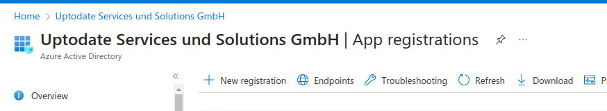

Fill fields

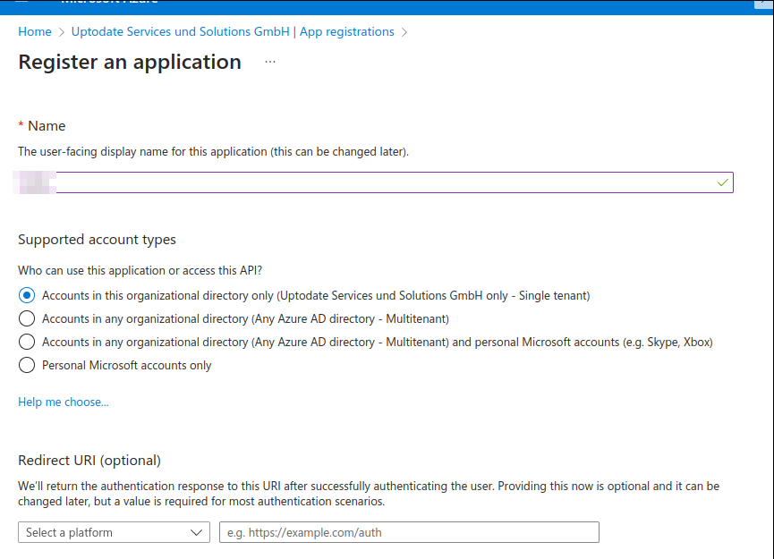

Click Register

Click Add a certificate or secret

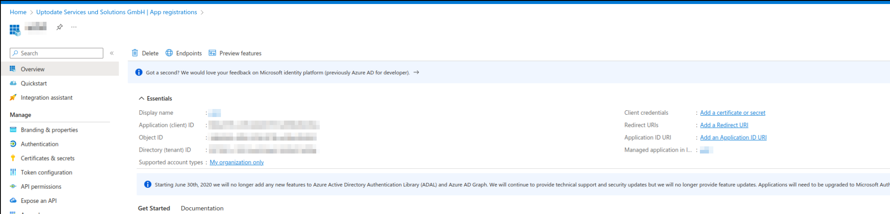

New client secret

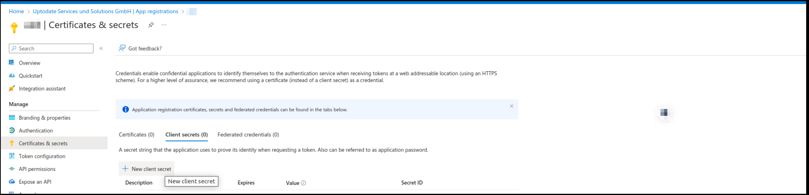

Fill fields

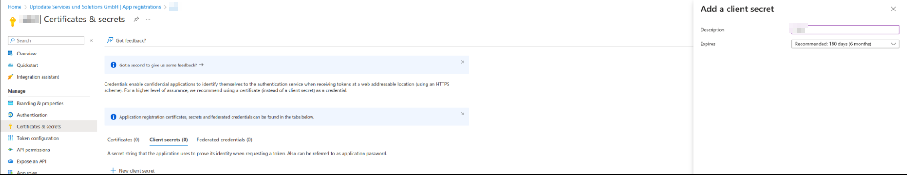

Click Add

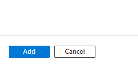

Copy value

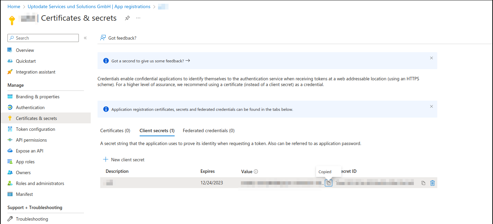

Select api permission

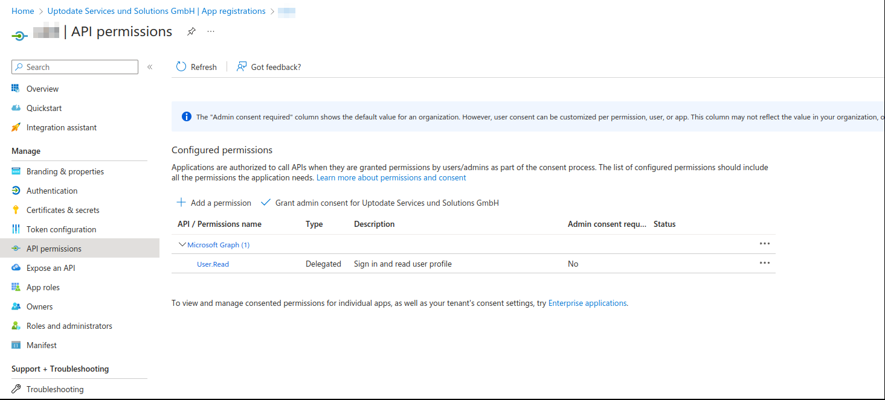

Add permissions->APIs my organization uses->Office 365 Exchange Online-> Application
permissions

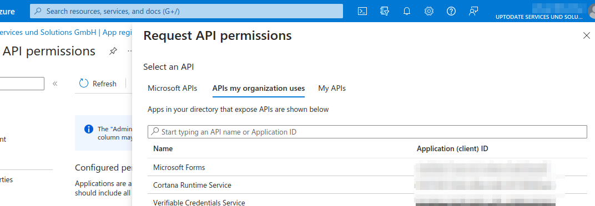
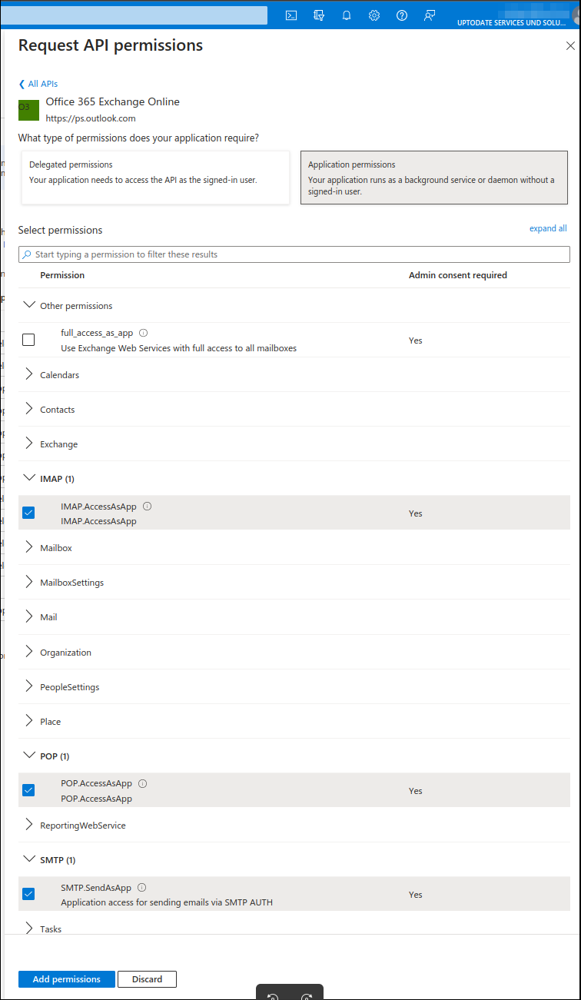

Add permissions

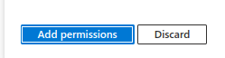

Add permissions->Microsoft Graph->Delegated permissions

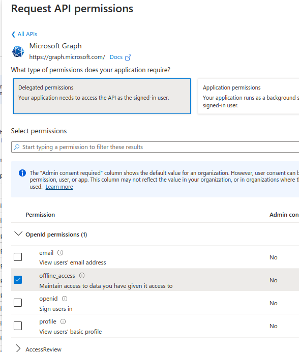

Create email account.
Enable:
https://admin.exchange.microsoft.com/#/mailboxes
Click on email - > Manage email apps settings

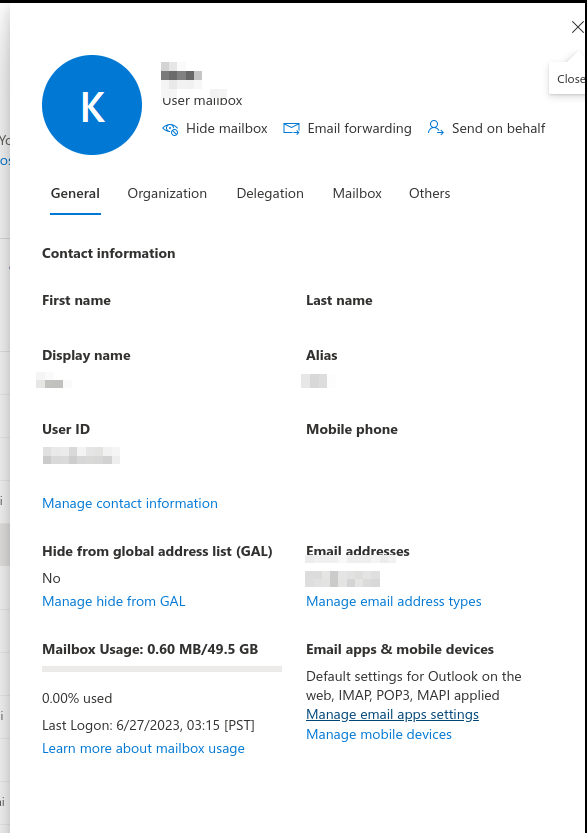

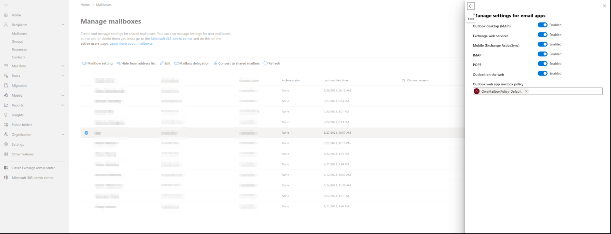

Register service principal
https://learn.microsoft.com/en-us/exchange/client-developer/legacy-protocols/how-to-authenticate-an-imap-pop-smtp-application-by-using-oauth#register-service-principals-in-exchange

Use

New-AzADServicePrincipal -ApplicationId <APPLICATION_ID>

instead

New-ServicePrincipal -AppId <APPLICATION_ID> -ServiceId <OBJECT_ID> [-Organization <ORGANIZATION_ID>]

Don't forget add Add-MailboxPermission for new email

New emails into existing app.

Enable https://admin.exchange.microsoft.com/#/mailboxes
Click on email - > Manage email apps settings
